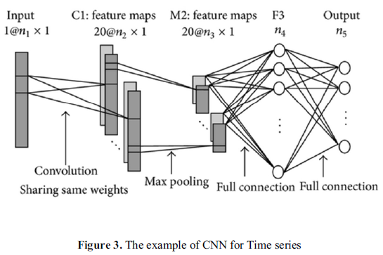
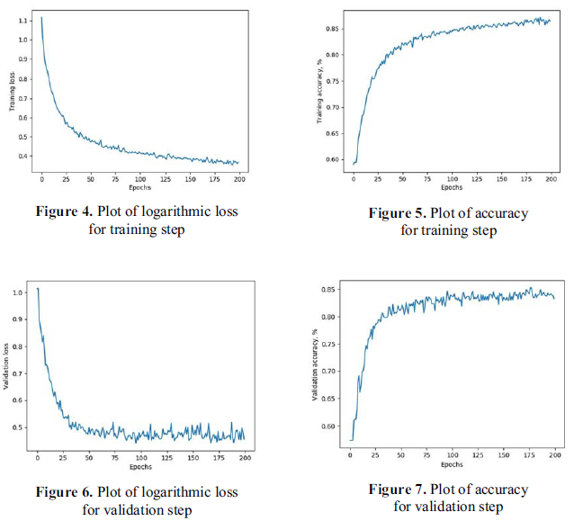

# ECGdeeplearning
### DL기반 ECG 데이터 분석하기
##### Heewon Na
##### 인공신경망 (2020)

* 심박과 관련된 생체 신호인 ECG는 심장의 전기적 활동이 시간에 따라 어떻게 변하는지를 측정해 이것을 바탕으로 심박 수의 변화를 나타내는 심장 박동 변화(HRV)를 계산할 수 있다. 크게 시간 영역과 주파수 영역으로 나누어 측정하게 되는데, HRV는 자율신경계 활동을 분석하는 확실한 방법으로 알려져 스트레스 연구에도 효과적으로 알려져 있음.
* 목표 : 현재 진행하고 있는 연구에서 수집할 ECG 데이터를 분석하기 위해 생성.
* HRV의 변화에 집중하여 Task1, 2 이전/이후 상태를 분석해 긍정/부정적인\변화가 있는지 살펴볼 것

##### 참고문헌 정리
1. Pyakillya, B., Kazachenko, N., & Mikhailovsky, N. (2017) Deep Learning for ECG Classification, In Journal of physics: conference series
* 특징: CNN을 통한 ECG 데이터 Classification
* 평가/측정 방법: 

4가지 class : normal sinus rhythm, arrhythmic, other kind of rhythm, very noisy

* 결과:

단점: 계산 복잡도가 높다.

2. Hong, S., Joung, D., Lee, J., Kim, D. Y., Kim, S., & Park, B. J. (2019). Effect of 2D Forest Video Viewing and Virtual Reality Forest Video Viewing on Stress Reduction in Adults. Journal of Korean Society of Forest Science
* 특징: 2D 숲 동영상 및 VR 숲 동영상 시청이 성인의 스트레스 감소에 미치는 영향 (실험 과정이 진행하고 있는 프로젝트와 유사)
* 평가/측정 방법:
N=40
2D 회색 동영상, 2D 숲 동영상, VR 숲 동영상을 5분동안 시청, 실험하는 동안 연속적으로 심박변이도(HRV)를 측정하여 자율신경계 활동을 평가
활동 변화를 측정하기 위해 Stress Index, High Frequency, Low Frequency/High Frequency 등을 직접 계산하여 지표로 사용
* 결과 :
2D 숲 동영상과  VR 숲 동영상이 2D회색 동영상보다 스트레스 감소 효과가 크다.
